# 💬 Private Messaging App

A real-time private messaging application built with React, Firebase, and Agora — similar to WhatsApp with video calling support.

## 🌐 Live Demo
[View Live App] https://joan-private-messaging-app.web.app
## ✨ Features

- 🔐 **Authentication** — Email/Password and Google Sign-In
- 💬 **Real-time Messaging** — Instant private messages between users
- 📞 **Video Calling** — Real-time video calls powered by Agora
- 📷 **Image Sharing** — Share photos in conversations
- 🟢 **Online/Offline Status** — See who's active
- ✅ **Read Receipts** — Know when messages are seen
- 👥 **Contact Management** — Add and delete contacts
- 🔍 **Search Contacts** — Find contacts quickly
- 📋 **Call History** — See call logs in chat
- 📱 **Mobile Responsive** — Works on all devices

## 🛠️ Built With

- **Frontend:** React + Vite
- **Styling:** Tailwind CSS
- **Backend:** Firebase (Auth + Firestore)
- **Video Calls:** Agora RTC SDK
- **Image Hosting:** Cloudinary
- **Deployment:** Firebase Hosting

## 🚀 Getting Started

### Prerequisites
- Node.js
- Firebase account
- Agora account
- Cloudinary account

### Installation

1. Clone the repo:
\```bash
git clone https://github.com/yourusername/private-messaging-app.git
cd private-messaging-app
\```

2. Install dependencies:
\```bash
npm install
\```

3. Create `.env` file:
\```
VITE_FIREBASE_API_KEY=your_key
VITE_FIREBASE_AUTH_DOMAIN=your_domain
VITE_FIREBASE_PROJECT_ID=your_project_id
VITE_FIREBASE_STORAGE_BUCKET=your_bucket
VITE_FIREBASE_MESSAGING_SENDER_ID=your_sender_id
VITE_FIREBASE_APP_ID=your_app_id
VITE_AGORA_APP_ID=your_agora_app_id
VITE_CLOUDINARY_CLOUD_NAME=your_cloud_name
VITE_CLOUDINARY_UPLOAD_PRESET=your_upload_preset
\```

4. Run the app:
\```bash
npm run dev
\```


## 📸 Screenshots

### Login Page
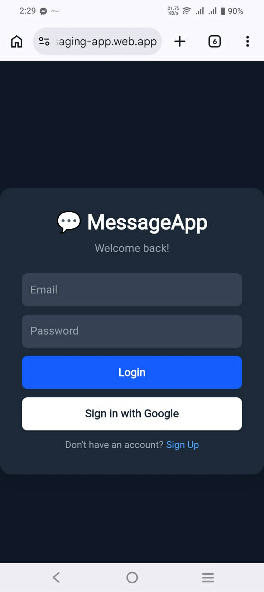
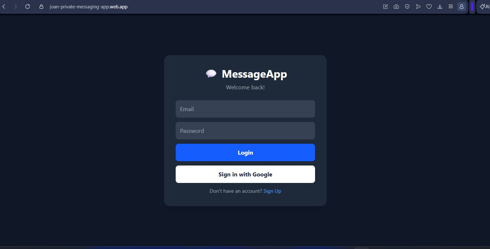

### Home Page
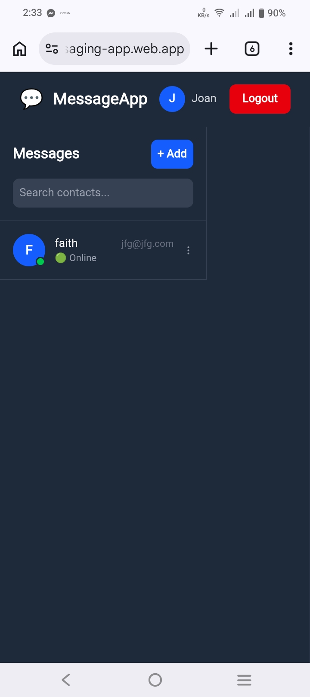
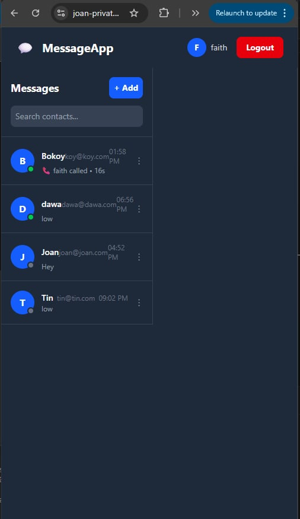

### Chat Page
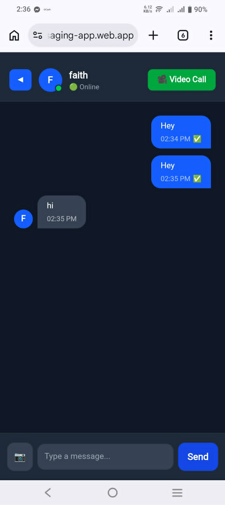
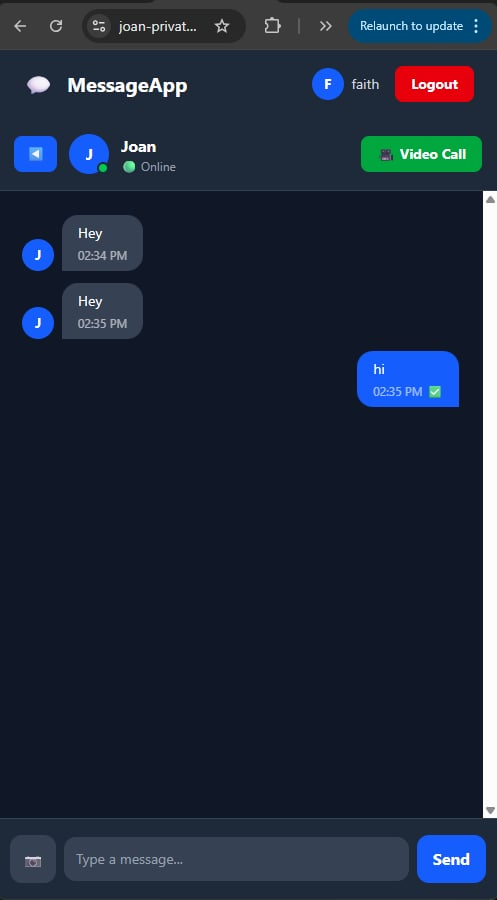

### Video Call
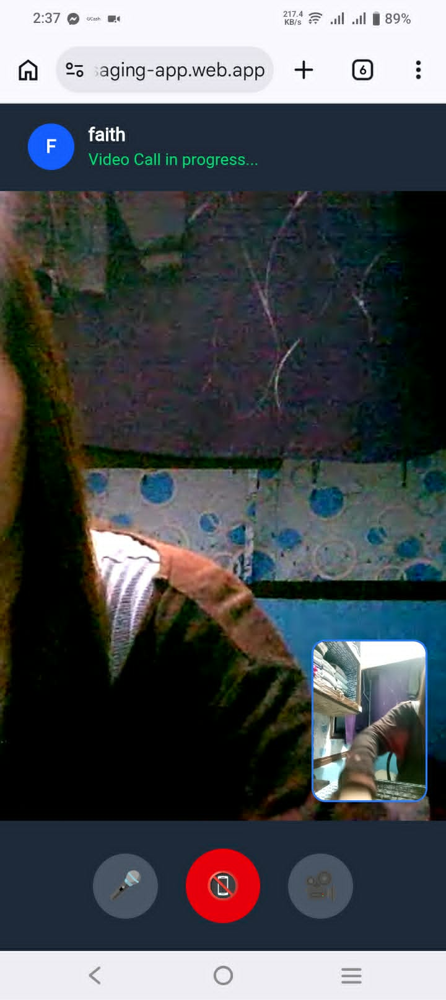
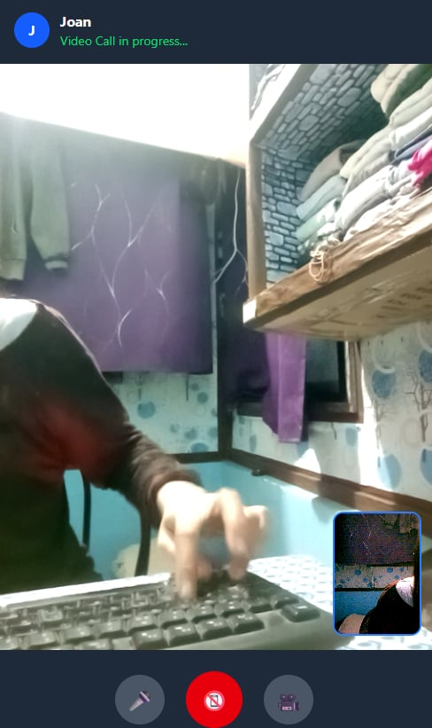

### Waiting For Answer
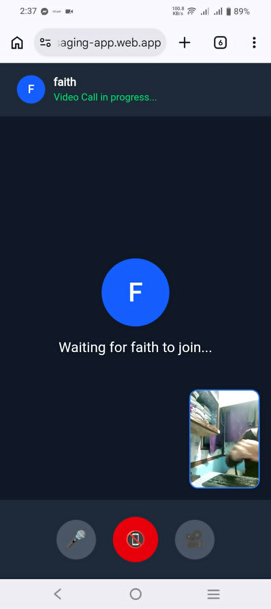
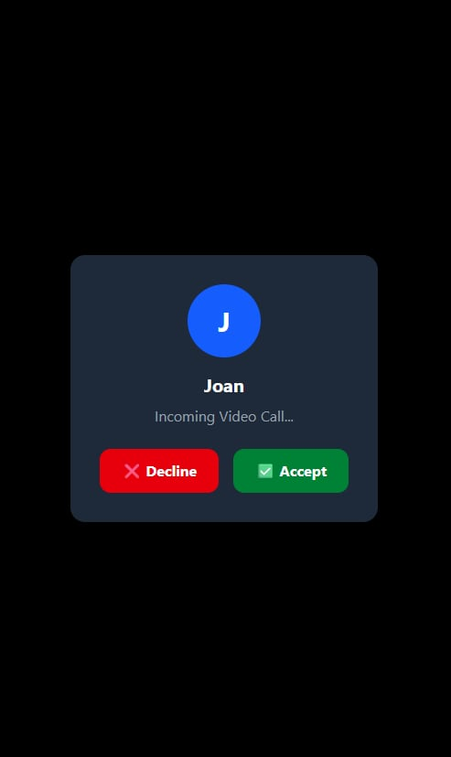

### After Call
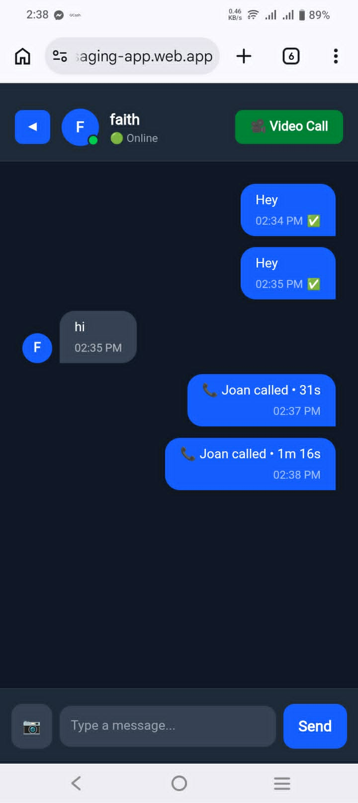
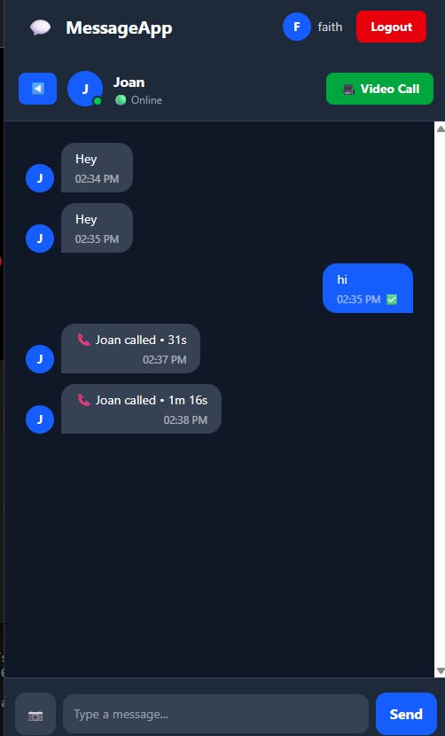


## 👩‍💻 Author

**Joan Faith**
- GitHub: [@joanfaith24](https://github.com/joanfaith24)

## 📄 License

This project is open source and available under the [MIT License](LICENSE).